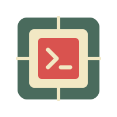

#  GemuthNexus
### *The Native Web Operating System*

---

**GemuthNexus** is a private, high-performance web operating system that extends the Linux kernel's identity model into a seamless, multi-user desktop environment.

[**Documentation Hub**](https://github.com/GemuthNexus/doc) • [**Vision**](https://github.com/GemuthNexus/doc/blob/main/vision/project-overview.md)

---

## 🧬 Core Philosophy
We believe the web browser should be a direct extension of your system's kernel. GemuthNexus is built on the principle of **Organic Integration**, ensuring that your digital life on the web is as secure, isolated, and powerful as a native shell session.

### 🛡️ The Pillars
*   **True Identity** | Your web session *is* your Linux session. Core kernel security, strictly enforced.
*   **Organic Isolation** | Applications run in their own native processes, protected by the system you trust.
*   **Human-Centric** | A "Biological OS" that feels alive, responsive, and tailored to the human, not the host.

---

*Built with ❤️ for the self-hosted future.*
